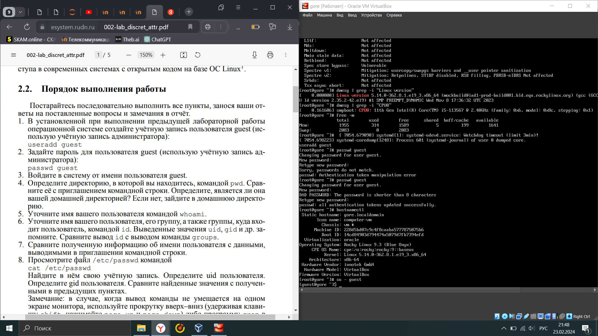
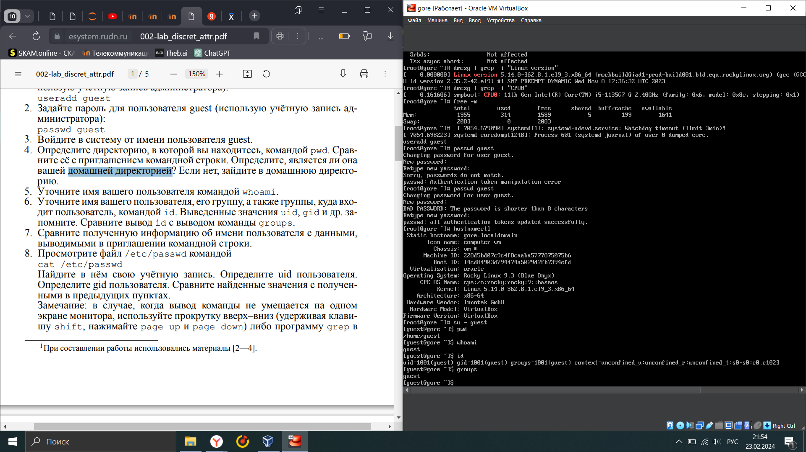
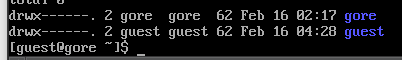
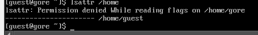
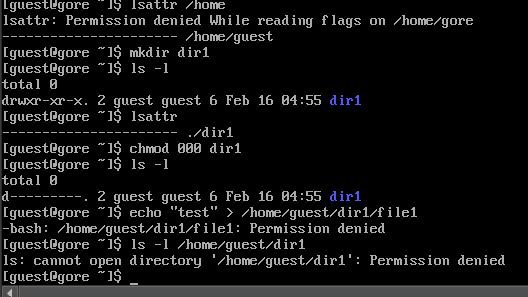

---
## Front matter
lang: ru-RU
title: Отчет по лабораторной работе 2
author:
  - Горяйнова А А
institute:
  - Российский университет дружбы народов, Москва, Россия
date: 16.02.2024

## i18n babel
babel-lang: russian
babel-otherlangs: english

## Formatting pdf
toc: false
toc-title: Содержание
slide_level: 2
aspectratio: 169
section-titles: true
theme: metropolis
header-includes:
 - \metroset{progressbar=frametitle,sectionpage=progressbar,numbering=fraction}
 - '\makeatletter'
 - '\beamer@ignorenonframefalse'
 - '\makeatother'
---

# Информация

## Докладчик

:::::::::::::: {.columns align=center}
::: {.column width="70%"}

  * Горяйнова Алёна Андреевна
  * студент
  * Российский университет дружбы народов

:::
::: {.column width="30%"}

:::
::::::::::::::

# Выполение лабораторной работы

## 1

{ #fig:001 width=70% }
 
## 2

{ #fig:002 width=70% }
 
## 3

{ #fig:003 width=70% }

## 4
{ #fig:004 width=70% }

{ #fig:005 width=70% }

{ #fig:006 width=70% }
 

:::

