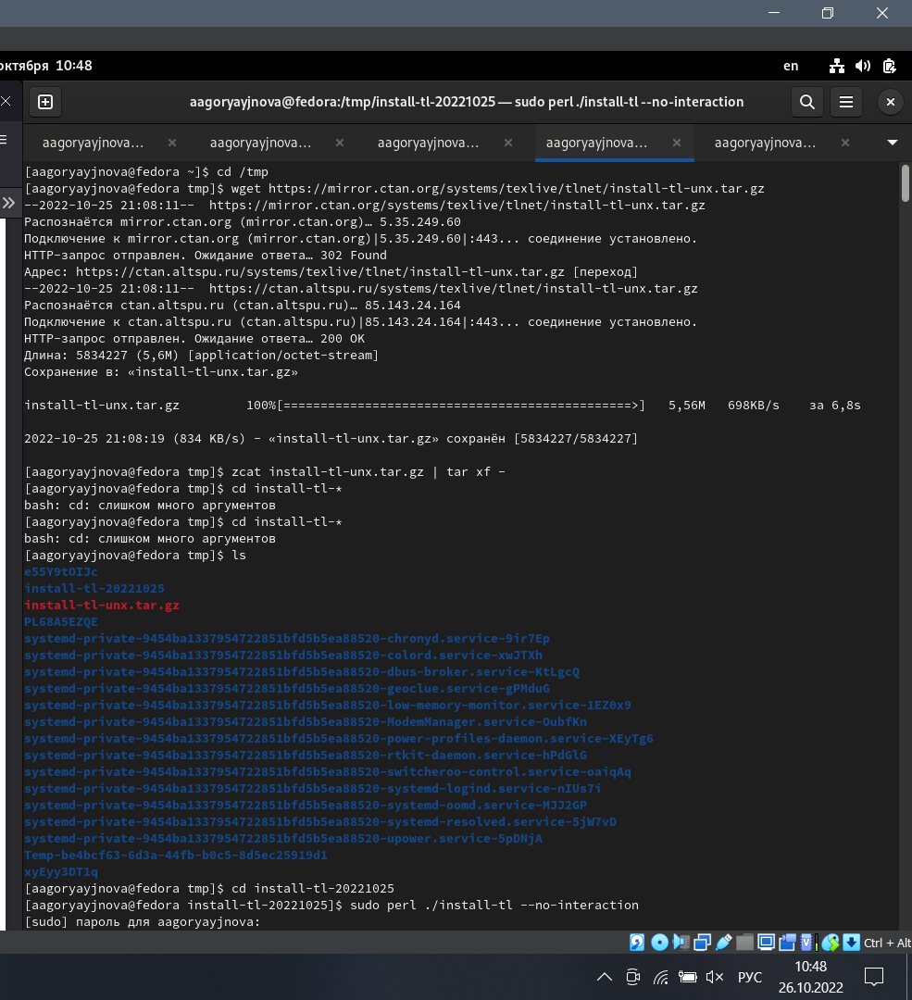
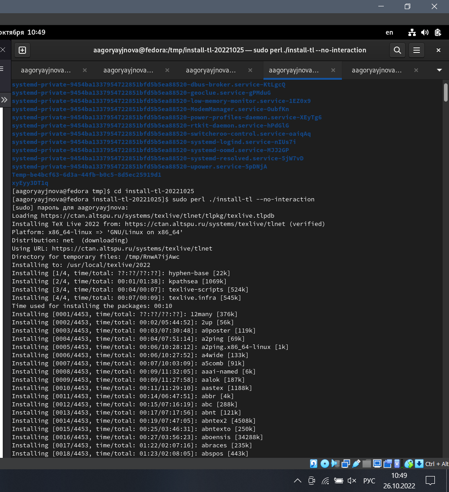
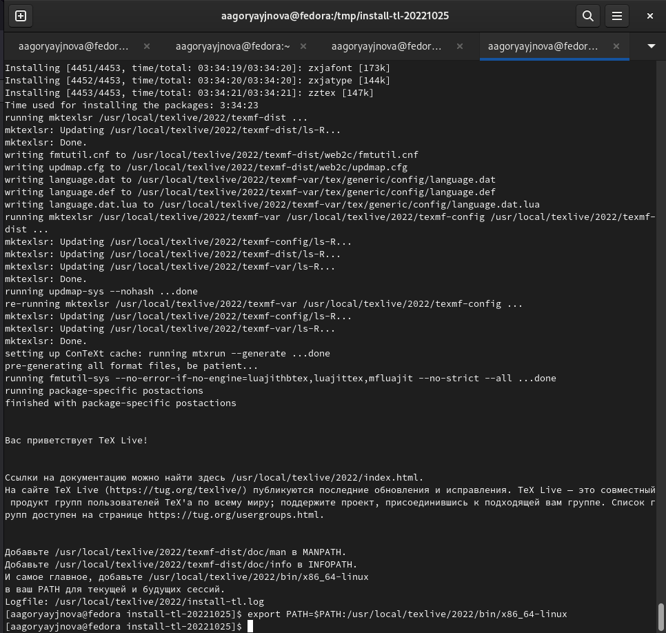
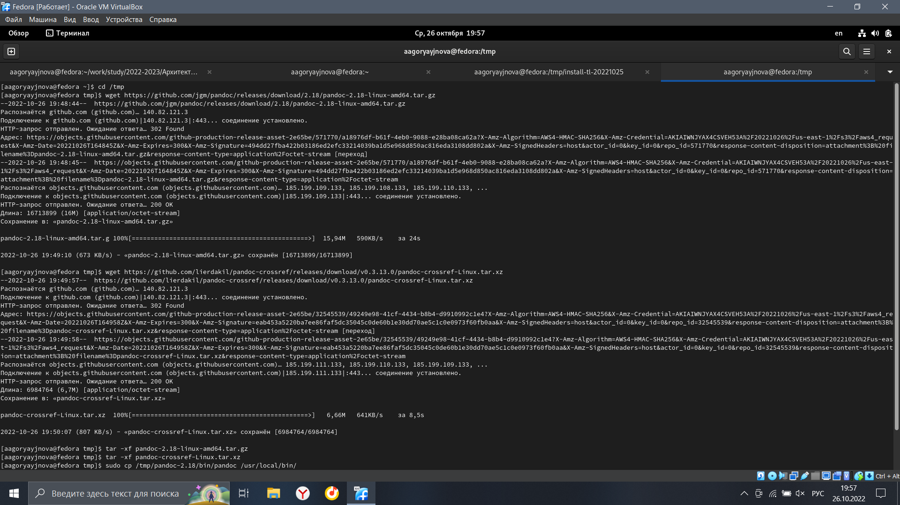
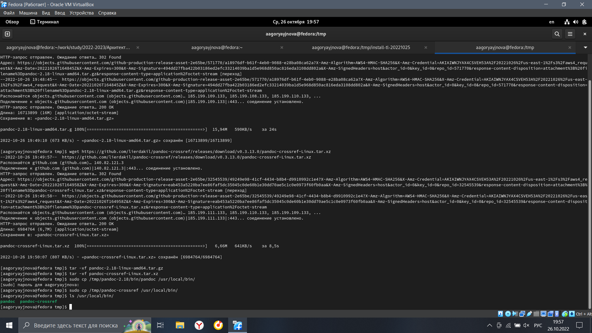
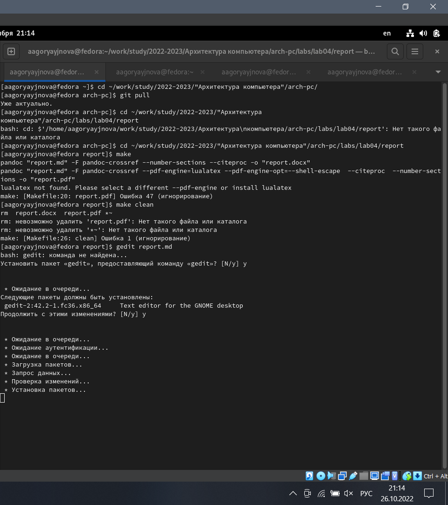
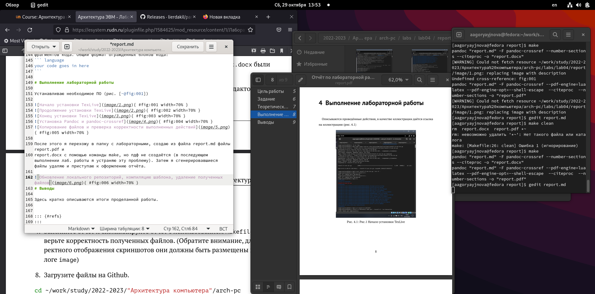

---
## Front matter
title: "Отчёт по лабораторной работе"
subtitle: "Язык разметки Markdown"
author: "Горяйнова Алёна Андреевна"

## Generic otions
lang: ru-RU
toc-title: "Содержание"

## Bibliography
bibliography: bib/cite.bib
csl: pandoc/csl/gost-r-7-0-5-2008-numeric.csl

## Pdf output format
toc: true # Table of contents
toc-depth: 2
lof: true # List of figures
lot: true # List of tables
fontsize: 12pt
linestretch: 1.5
papersize: a4
documentclass: scrreprt
## I18n polyglossia
polyglossia-lang:
  name: russian
  options:
	- spelling=modern
	- babelshorthands=true
polyglossia-otherlangs:
  name: english
## I18n babel
babel-lang: russian
babel-otherlangs: english
## Fonts
mainfont: PT Serif
romanfont: PT Serif
sansfont: PT Sans
monofont: PT Mono
mainfontoptions: Ligatures=TeX
romanfontoptions: Ligatures=TeX
sansfontoptions: Ligatures=TeX,Scale=MatchLowercase
monofontoptions: Scale=MatchLowercase,Scale=0.9
## Biblatex
biblatex: true
biblio-style: "gost-numeric"
biblatexoptions:
  - parentracker=true
  - backend=biber
  - hyperref=auto
  - language=auto
  - autolang=other*
  - citestyle=gost-numeric
## Pandoc-crossref LaTeX customization
figureTitle: "Рис."
tableTitle: "Таблица"
listingTitle: "Листинг"
lofTitle: "Список иллюстраций"
lotTitle: "Список таблиц"
lolTitle: "Листинги"
## Misc options
indent: true
header-includes:
  - \usepackage{indentfirst}
  - \usepackage{float} # keep figures where there are in the text
  - \floatplacement{figure}{H} # keep figures where there are in the text
---

# Цель работы

Освоить процедуры оформления отчетов с помощью
легковесного языка разметки Markdown.

# Задание

1) Установить следующее ПО:
-  TeX Live (https://www.tug.org/texlive/) последней версии.
-  Pandoc (https://pandoc.org/) версии v2.18
-  Pandoc-crossref (https://github.com/lierdakil/pandoc-crossref/releases) версии v0.3.13.0
2) Выполнить лабораторную работу
3) Сделать отчет, предоставить в трёх форматах
4) Загрузить на github

# Теоретическое введение

Чтобы создать заголовок, используйте знак #, например:

 # This is heading 1  
 # This is heading 2
 ### This is heading 3
 #### This is heading 4

Чтобы задать для текста полужирное начертание, заключите его в двойные
звездочки:

This text is **bold**.

Чтобы задать для текста курсивное начертание, заключите его в одинарные
звездочки:

This text is *italic*.

Чтобы задать для текста полужирное и курсивное начертание, заключите его
в тройные звездочки:

This is text is both ***bold and italic***.

Блоки цитирования создаются с помощью символа >:

> The drought had lasted now for ten million years, and the reign of
the terrible lizards had long since ended. Here on the Equator,
in the continent which would one day be known as Africa, the
battle for existence had reached a new climax of ferocity, and
the victor was not yet in sight. In this barren and desiccated
land, only the small or the swift or the fierce could flourish,
or even hope to survive.

Упорядоченный список можно отформатировать с помощью соответствую-
щих цифр:

1. First instruction
   1. Sub-instruction
   1. Sub-instruction
1. Second instruction

Чтобы вложить один список в другой, добавьте отступ для элементов дочер-
него списка:

1. First instruction
1. Second instruction
1. Third instruction

Неупорядоченный (маркированный) список можно отформатировать с помо-
щью звездочек или тире:

* List item 1
* List item 2
* List item 3

Чтобы вложить один список в другой, добавьте отступ для элементов дочер-
него списка:

- List item 1
  - List item A
  - List item B
- List item 2

Синтаксис Markdown для встроенной ссылки состоит из части [link text],
представляющей текст гиперссылки, и части (file-name.md) – URL-адреса или
имени файла, на который дается ссылка:

[link text](file-name.md) или [link text](http://example.com/ "Необязательная подсказка")

Markdown поддерживает как встраивание фрагментов кода в предложение,
так и их размещение между предложениями в виде отдельных огражденных
блоков. Огражденные блоки кода — это простой способ выделить синтаксис для
фрагментов кода. Общий формат огражденных блоков кода:
``` language
your code goes in here
```

# Выполнение лабораторной работы

Устанавливаю необходимое ПО (рис. [-@fig:1],[-@fig:2],[-@fig:3],[-@fig:4],[-@fig:5]) 

{ #fig:1 width=70% }

{ #fig:2 width=70% }

{ #fig:3 width=70% }

{ #fig:4 width=70% }

{ #fig:5 width=70% }

После этого я перехожу в папку с лабораторными, создаю из файла report.md файлы report.pdf и
report.docx с помощью команды make, но пдф не создаётся (в последующем выполнении лаб. работы я устраняю эту проблему). Затем я сгенерировавшиеся файлы удаляю и приступаю к оформлению отчёта.(рис. [-@fig:6])

{ #fig:6 width=70% }

Дальше я просто создаю отчёт по шаблону и изучаю Markdown(рис. [-@fig:7]

{ #fig:7 width=70% }

# Выводы

Я установила всё необходимое ПО и освоила процедуры оформления отчетов с помощьюлегковесного языка разметки Markdown.


::: {#refs}
:::
