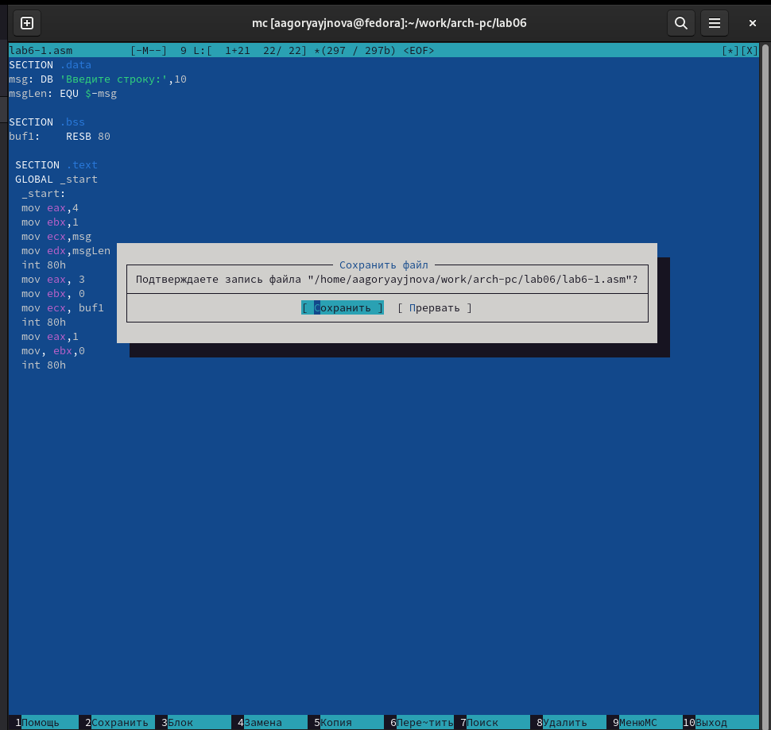
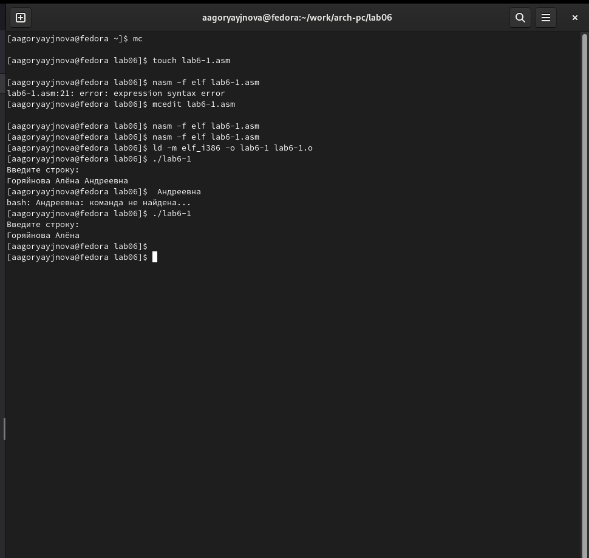
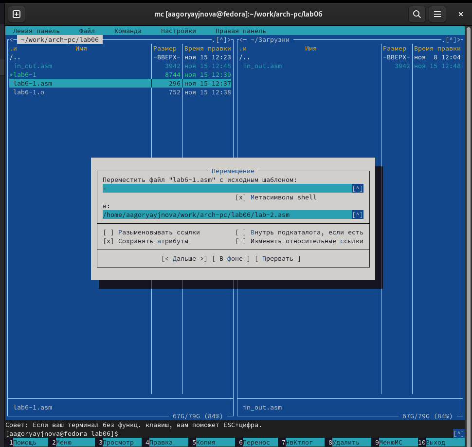
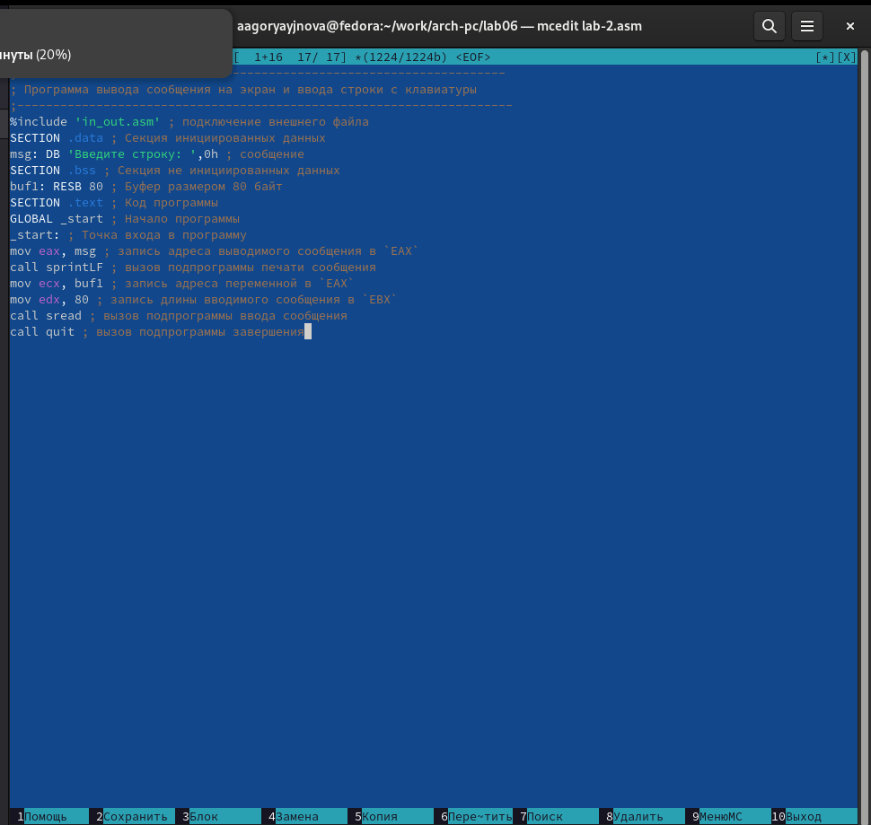
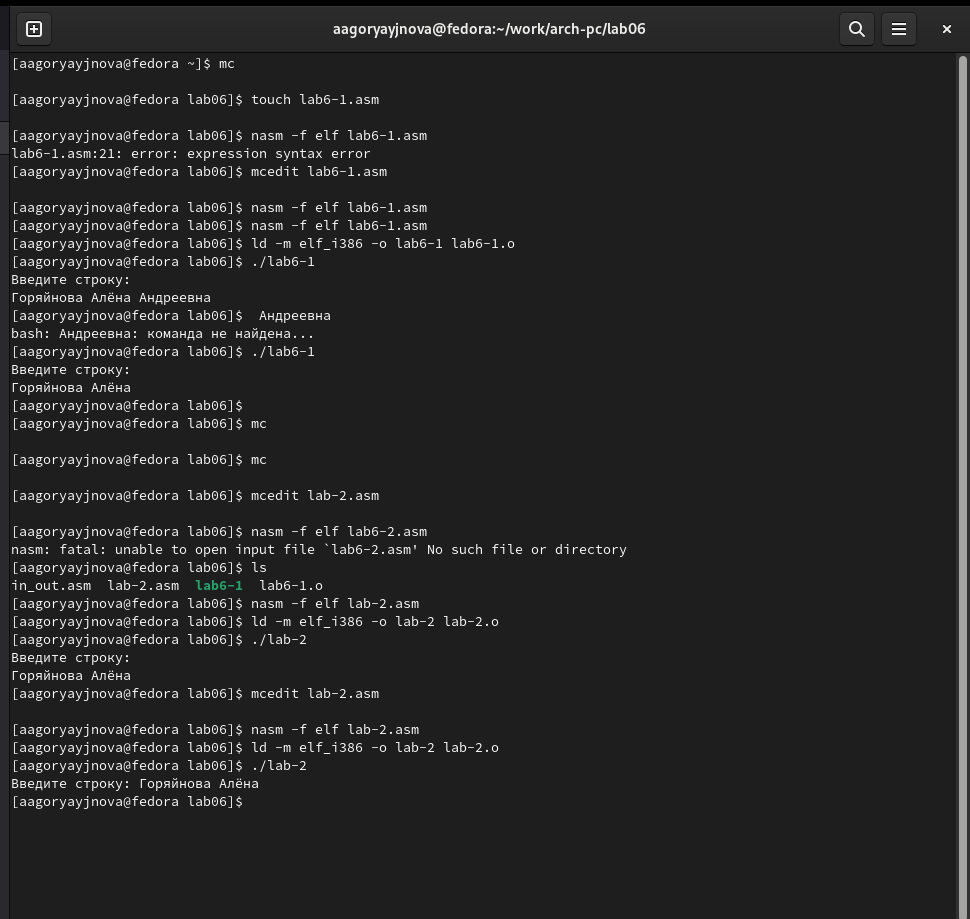
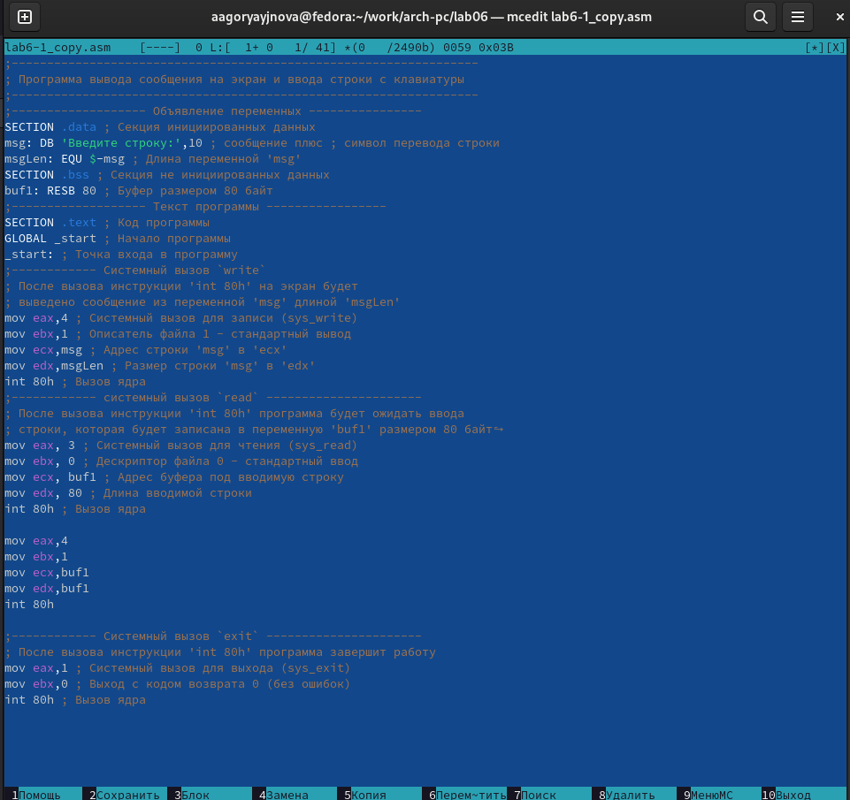
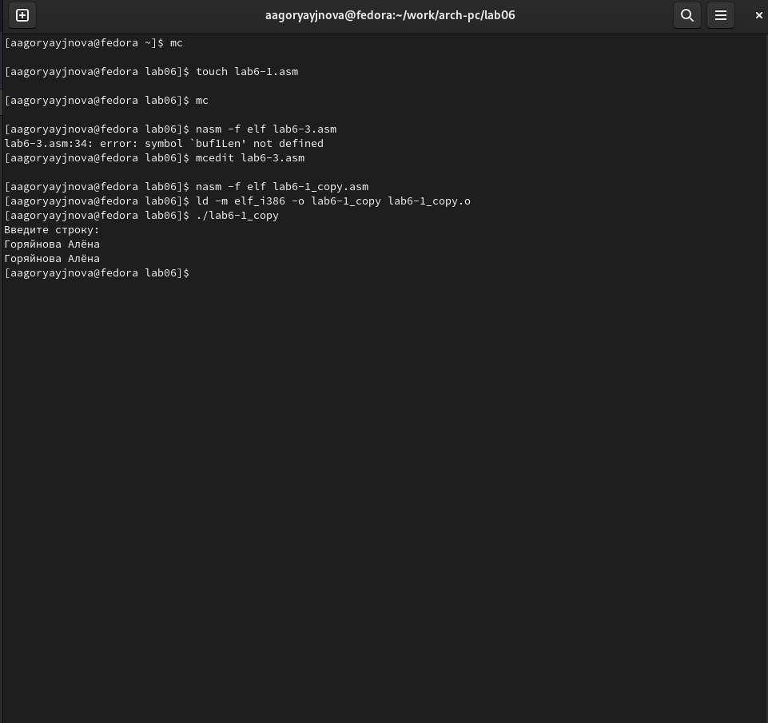
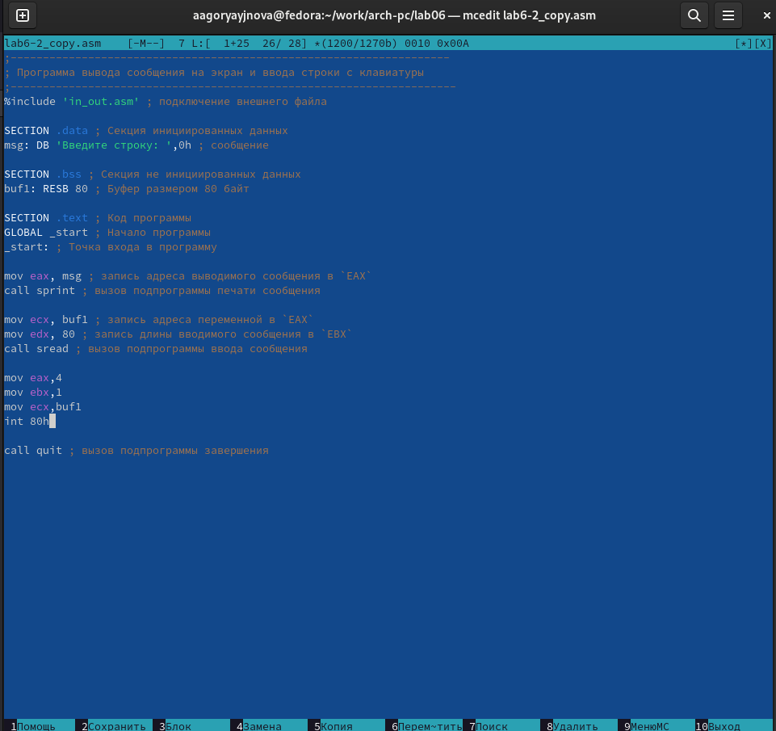
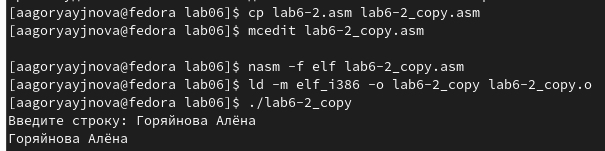

---
## Front matter
title: "Отчёт по лабораторной работе №6"
subtitle: "Основы работы с Midnight Commander (mc). Структура программы на языке ассемблера NASM. Системные вызовы в ОС GNU Linux"
author: "Горяйнова Алёна"

## Generic otions
lang: ru-RU
toc-title: "Содержание"

## Bibliography
bibliography: bib/cite.bib
csl: pandoc/csl/gost-r-7-0-5-2008-numeric.csl

## Pdf output format
toc: true # Table of contents
toc-depth: 2
lof: true # List of figures
lot: true # List of tables
fontsize: 12pt
linestretch: 1.5
papersize: a4
documentclass: scrreprt
## I18n polyglossia
polyglossia-lang:
  name: russian
  options:
	- spelling=modern
	- babelshorthands=true
polyglossia-otherlangs:
  name: english
## I18n babel
babel-lang: russian
babel-otherlangs: english
## Fonts
mainfont: PT Serif
romanfont: PT Serif
sansfont: PT Sans
monofont: PT Mono
mainfontoptions: Ligatures=TeX
romanfontoptions: Ligatures=TeX
sansfontoptions: Ligatures=TeX,Scale=MatchLowercase
monofontoptions: Scale=MatchLowercase,Scale=0.9
## Biblatex
biblatex: true
biblio-style: "gost-numeric"
biblatexoptions:
  - parentracker=true
  - backend=biber
  - hyperref=auto
  - language=auto
  - autolang=other*
  - citestyle=gost-numeric
## Pandoc-crossref LaTeX customization
figureTitle: "Рис."
tableTitle: "Таблица"
listingTitle: "Листинг"
lofTitle: "Список иллюстраций"
lotTitle: "Список таблиц"
lolTitle: "Листинги"
## Misc options
indent: true
header-includes:
  - \usepackage{indentfirst}
  - \usepackage{float} # keep figures where there are in the text
  - \floatplacement{figure}{H} # keep figures where there are in the text
---

# Цель работы

Приобрести практические навыки работы в Midnight Commander. Освоить
инструкции языка ассемблера mov и int.

# Задание

Написать небольшие программы для вывода текста на экран и ввода текста с клавиатуры несколькими способами.

# Теоретическое введение

Midnight Commander (или просто mc) — это программа, которая позволяет
просматривать структуру каталогов и выполнять основные операции по управ-
лению файловой системой, т.е. mc является файловым менеджером. Midnight
Commander позволяет сделать работу с файлами более удобной и наглядной.

# Выполнение лабораторной работы

Я перешла в нужный каталог с помощью Midnight Commander, создала папку lab06 и файл lab6-1.asm, после чего отркрыла редактор и ввела текст из листинга 6.1 (рис. [-@fig:1])

{ #fig:1 width=70% }

Дальше я оттранслировала текст программы  lab6-1.asm в объектный файл. Выполнила компоновку объектного файла и запустила получившийся исполняемый файл (рис. [-@fig:2])

{ #fig:2 width=70% }

Скачала файл in_out.asm со страницы курса в ТУИС и скопировала файл in_out.asm в каталог с файлом lab6-1.asm. (рис. [-@fig:3])

{ #fig:3 width=70% }

После этого я создала копию файла lab6-1.asm с именем lab6-2.asm , исправила текст программы в файле lab6-2.asm с использование подпрограмм из внешнего файла in_out.asm  в соответствии с листингом 6.2. (рис. [-@fig:4])

{ #fig:4 width=70% }

Тут я создала исполняемый файл изапустила его, потом сделала то же самое, заменив подпрограмму sprintLF на sprint (разница в наличии перехода на следующую строку после вывода текста). (рис. [-@fig:5])

{ #fig:5 width=70% }

Дальше я приступила к заданиям для самостоятельной работы. Но поскольку файл lab6-1.asm у меня не сохранился, я создала новый и потом переименовала в lab6-1_copy.asm (потом я снова создала исходный lab6-1.asm). Поменяла код так, чтобы он выводил то, что вводят с клавиатуры. Создала исполняемый файл и запустила его. (рис. [-@fig:6],[-@fig:7])

{ #fig:6 width=70% }

{ #fig:7 width=70% }

Аналогичные действия я проделала с файлом lab6-2.asm. (рис. [-@fig:8],[-@fig:9])

{ #fig:8 width=70% }

{ #fig:9 width=70% }

# Выводы

Я приобрела практические навыки работы в Midnight Commander и освоила
инструкции языка ассемблера mov и int.

# Список литературы{.unnumbered}

::: {#refs}
:::
