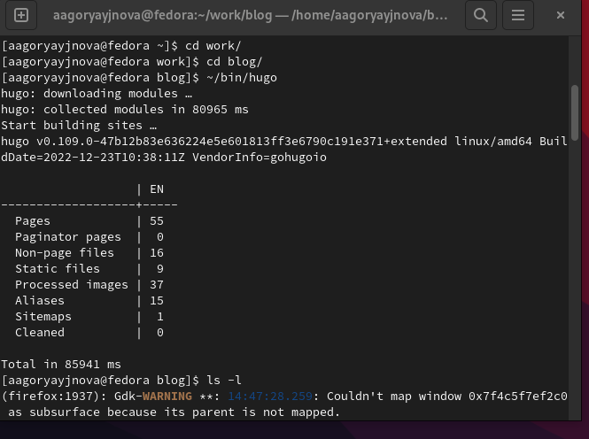
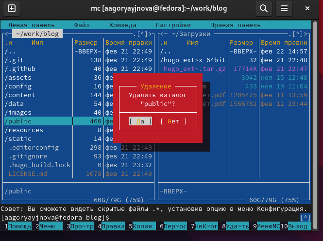
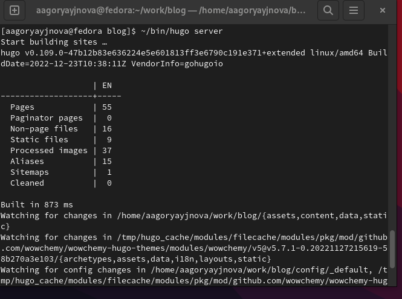
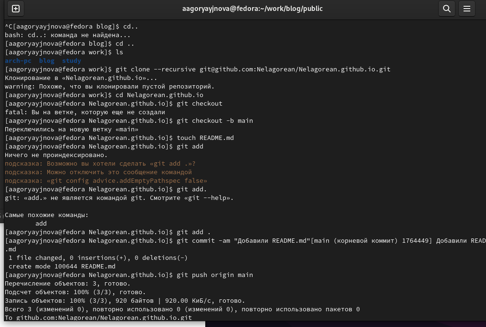
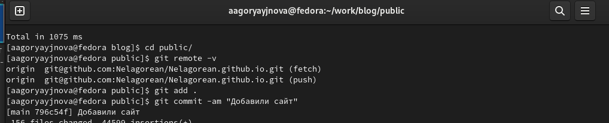

---
## Front matter
lang: ru-RU
title: 1й этап индивидуального проекта
subtitle: Создание сайта на Hugo
author:
  - Горяйнова Алёна.
institute:
  - Российский университет дружбы народов, Москва, Россия
date: 22 февраля 2023

## i18n babel
babel-lang: russian
babel-otherlangs: english

## Formatting pdf
toc: false
toc-title: Содержание
slide_level: 2
aspectratio: 169
section-titles: true
theme: metropolis
header-includes:
 - \metroset{progressbar=frametitle,sectionpage=progressbar,numbering=fraction}
 - '\makeatletter'
 - '\beamer@ignorenonframefalse'
 - '\makeatother'
---

# Информация

## Докладчик

:::::::::::::: {.columns align=center}
::: {.column width="70%"}

  * Горяйнова Алёна Андреевна
  * студент 1го курса физмата
  * Российский университет дружбы народов
  * <https://nelagorean.github.io>

:::
::: {.column width="30%"}

:::
::::::::::::::

## Цель работы

Создать сайт на Hugo

## Задание

1. Установить необходимое программное обеспечение.
2. Скачать шаблон темы сайта.
2. Разместить его на хостинге git.
3. Установить параметр для URLs сайта.
4. Разместить заготовку сайта на Github pages.

## Теоретическое введение

Сайт – это совокупность веб-страниц, объединённых под общим доменом и связанных ссылками, тематикой и дизайнерским оформлением. Мы будем создавать статический сайт, для этого нам понадобится Hugo. Hugo — генератор статических страниц для интернета.

## Выполнение 1го этапа инд. проекта

Установим необходимое програмное обеспечение. Скачаем Hugo, распаковываем архим и переносим в новую папку bin в домю каталоге.   
В качестве шаблона индивидуального сайта используется шаблон Hugo Academic Theme. Переходим по ссылке и создаем репозиторий blog, копируем его. Выполняем команду hugo и удаляем "public" из blog.

{#fig:001 width=50%}

{#fig:002 width=50%}

##

Выполним команду hugo server (создадутся необходимые файлы). Нам предоставят ссылку. Переходя по ней, открывается наш сайт

{#fig:001 width=50%}

##  

Cоздаем еще один репозиторий. Клонируем наш новый репозиторий. Создаем ветку main. Создаем файл README.md. Добавляем в наш репозиторий. 

{#fig:004 width=50%}

##  

Подключаем наш репозиторий к папке public, проверяем всё ли получилось и добавляем файлы в репозиторий.

{#fig:005 width=50%}

## Выводы

Научились создавать статические сайты с помощью Hugo.

