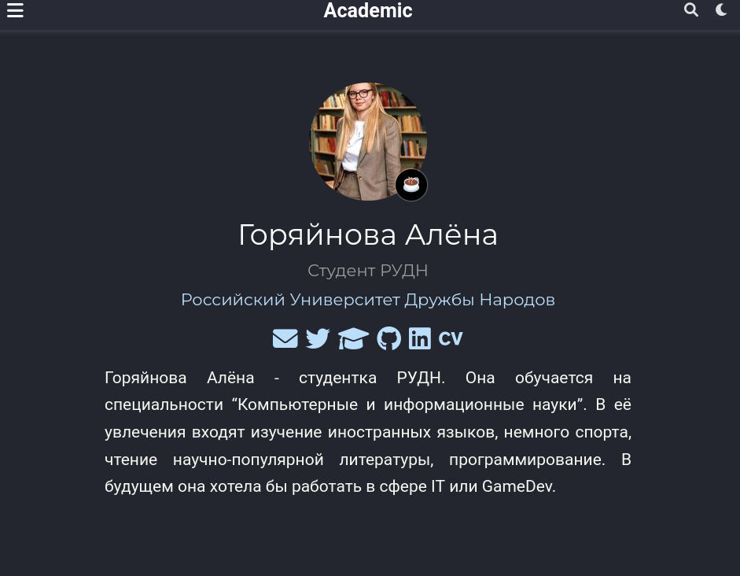
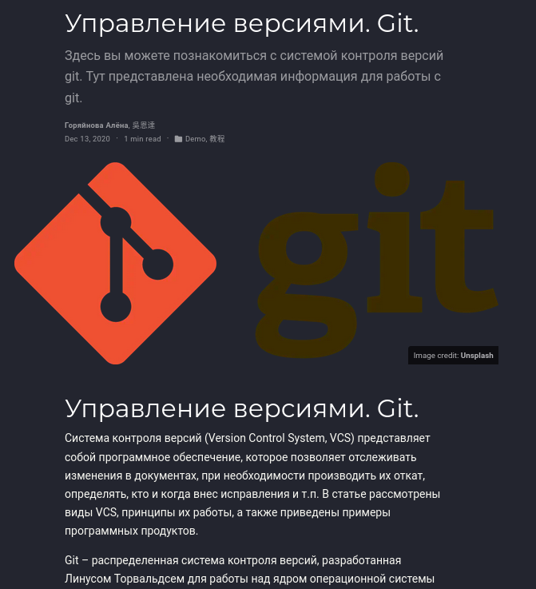
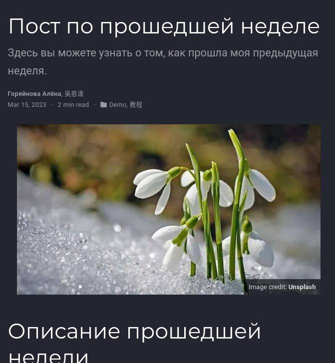

---
## Front matter
lang: ru-RU
title: Отчёт по выполнению 2го этапа Индивидуального проекта
subtitle: Добавлениее данных о себе на сайт
author:
  - Горяйнова АА
institute:
  - Российский университет дружбы народов, Москва, Россия

## i18n babel
babel-lang: russian
babel-otherlangs: english

## Formatting pdf
toc: false
toc-title: Содержание
slide_level: 2
aspectratio: 169
section-titles: true
theme: metropolis
header-includes:
 - \metroset{progressbar=frametitle,sectionpage=progressbar,numbering=fraction}
 - '\makeatletter'
 - '\beamer@ignorenonframefalse'
 - '\makeatother'
---

# Информация

## Докладчик

:::::::::::::: {.columns align=center}
::: {.column width="70%"}

  * Горяйнова Алёна Андреевна
  * студентка 1го курса
  * Российский университет дружбы народов
  
:::
::::::::::::::

# Цель работы

Постепенно заполнять сайт информацией о себе, новыми постами и тд.

# Задание

- Разместить фотографию владельца сайта.
- Разместить краткое описание владельца сайта (Biography).
- Добавить информацию об интересах (Interests).
- Добавить информацию от образовании (Education).
- Сделать пост по прошедшей неделе.
- Добавить пост на тему "Управление версиями. Git."
  

# Выполнение лабораторной работы

Редактируем сайт через изменение файлов в папке blog и клонируем в соответсвующий репозиторий
Поменяли аватар

{#fig:001 width=70%} 

## 

Создали статью про системы контроля версий, поменяли картинку

{#fig:002 width=70%}

## 

Написали статью про прощедшую неделю и тоже добавили картинку

{#fig:003 width=70%}

Всё это загрузилось на сайт и готово)

# Выводы

Я научилась работать с некоторой информацией на сайте, создавать посты и менять аватар

