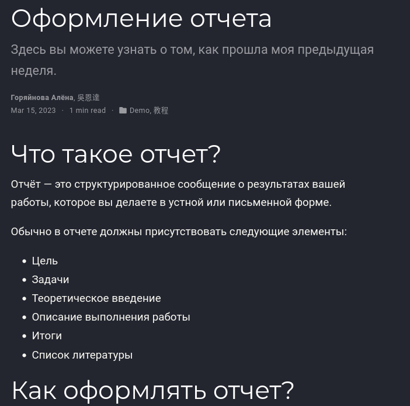
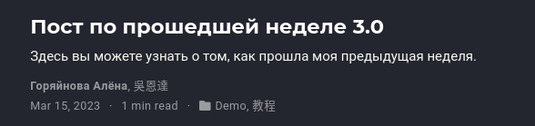
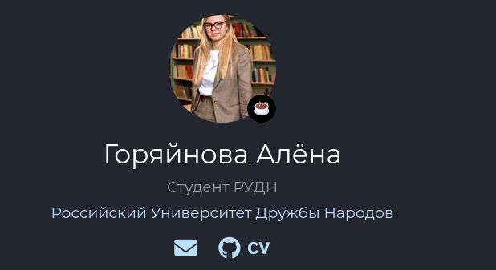

---
## Front matter
lang: ru-RU
title: 4й этап Индивидуального проекта
author:
  - Горяйнова АА
institute:
  - Российский университет дружбы народов, Москва, Россия

## i18n babel
babel-lang: russian
babel-otherlangs: english

## Formatting pdf
toc: false
toc-title: Содержание
slide_level: 2
aspectratio: 169
section-titles: true
theme: metropolis
header-includes:
 - \metroset{progressbar=frametitle,sectionpage=progressbar,numbering=fraction}
 - '\makeatletter'
 - '\beamer@ignorenonframefalse'
 - '\makeatother'
---

# Информация

## Докладчик

:::::::::::::: {.columns align=center}
::: {.column width="70%"}

  * Горяйнова Алёна
  * студентка
  * Российский университет дружбы народов

:::
::: {.column width="30%"}

:::
::::::::::::::

# Цель работы

Продолжить редактирование своего сайта. Добавить ссылки на научные ресурсы.

# Задание

 - Добавить к сайту ссылки на научные и библиометрические ресурсы.
 - Сделать пост по прошедшей неделе.
 - Добавить пост на тему по выбору:
       - Оформление отчёта   
       - Создание презентаций   
       - Работа с библиографией  

# Выполнение лабораторной работы

Пост по оформлению отчета

{#fig:001 width=70%}

## Пост по прошедшей неделе

{#fig:002 width=70%}

## Ссылки

{#fig:003 width=70%}

# Выводы

В процессе выполнения этого этапа проекта я добавила на сайт ссылки на свои научные аккаунты, а также написала два поста.

:::

