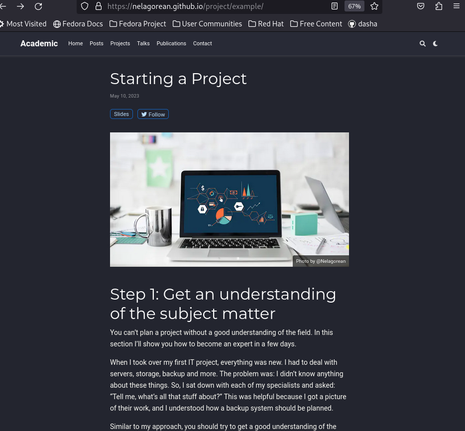
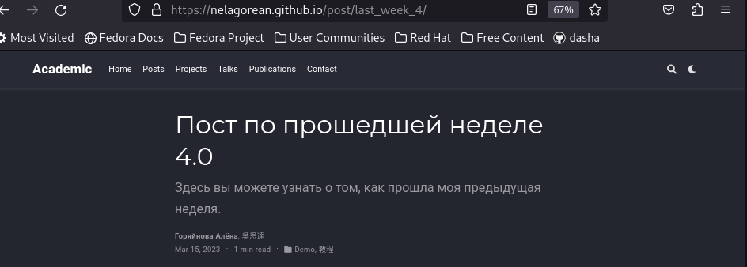
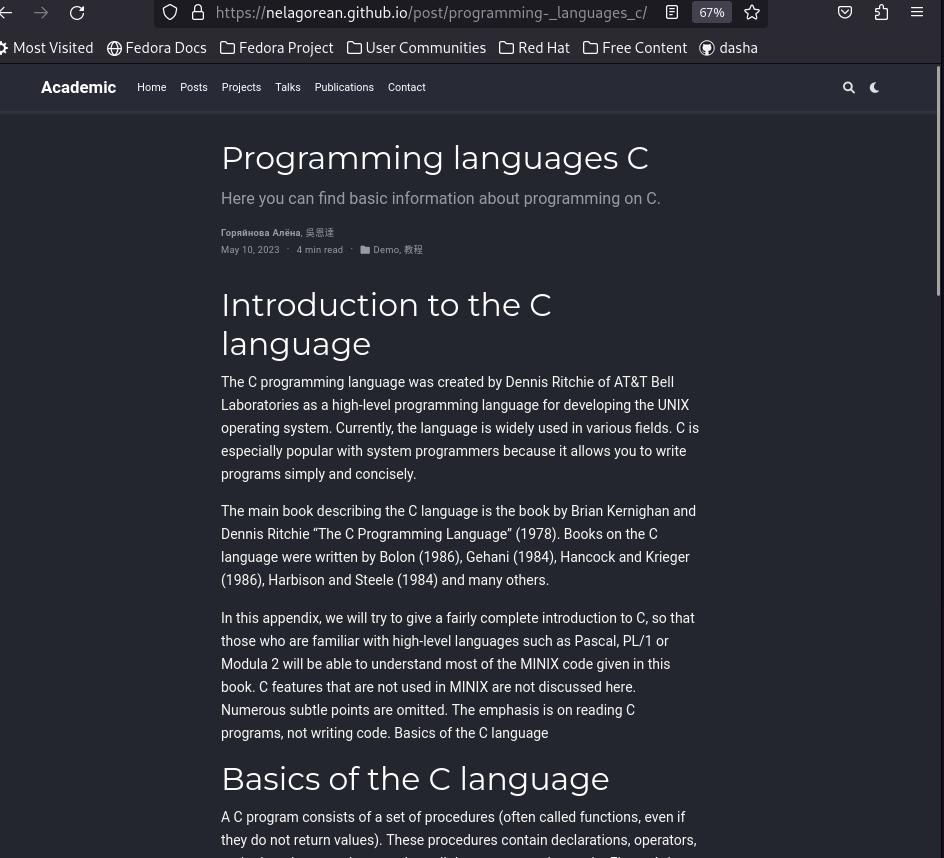

---
## Front matter
lang: ru-RU
title: Индивидуальный проект
subtitle: 6й этап
author:
  - Горяйнова АА
institute:
  - Российский университет дружбы народов, Москва, Россия

## i18n babel
babel-lang: russian
babel-otherlangs: english

## Formatting pdf
toc: false
toc-title: Содержание
slide_level: 2
aspectratio: 169
section-titles: true
theme: metropolis
header-includes:
 - \metroset{progressbar=frametitle,sectionpage=progressbar,numbering=fraction}
 - '\makeatletter'
 - '\beamer@ignorenonframefalse'
 - '\makeatother'
---

# Информация

## Докладчик

:::::::::::::: {.columns align=center}
::: {.column width="70%"}

  * Горяйнова Алёна
  * студентка
  * Российский университет дружбы народов

:::
::: {.column width="30%"}

:::
::::::::::::::

# Цель работы

Заполнить сайт

# Задание

  -  Сделать записи для персональных проектов.
   - Сделать пост по прошедшей неделе.
  -  Добавить пост на тему Языки научного программирования.

# Выполнение лабораторной работы

Добавили нужную информацию

{#fig:001 width=70%}

{#fig:002 width=70%}

{#fig:003 width=70%}

# Выводы

Заполнили сайт необходимыми данными

